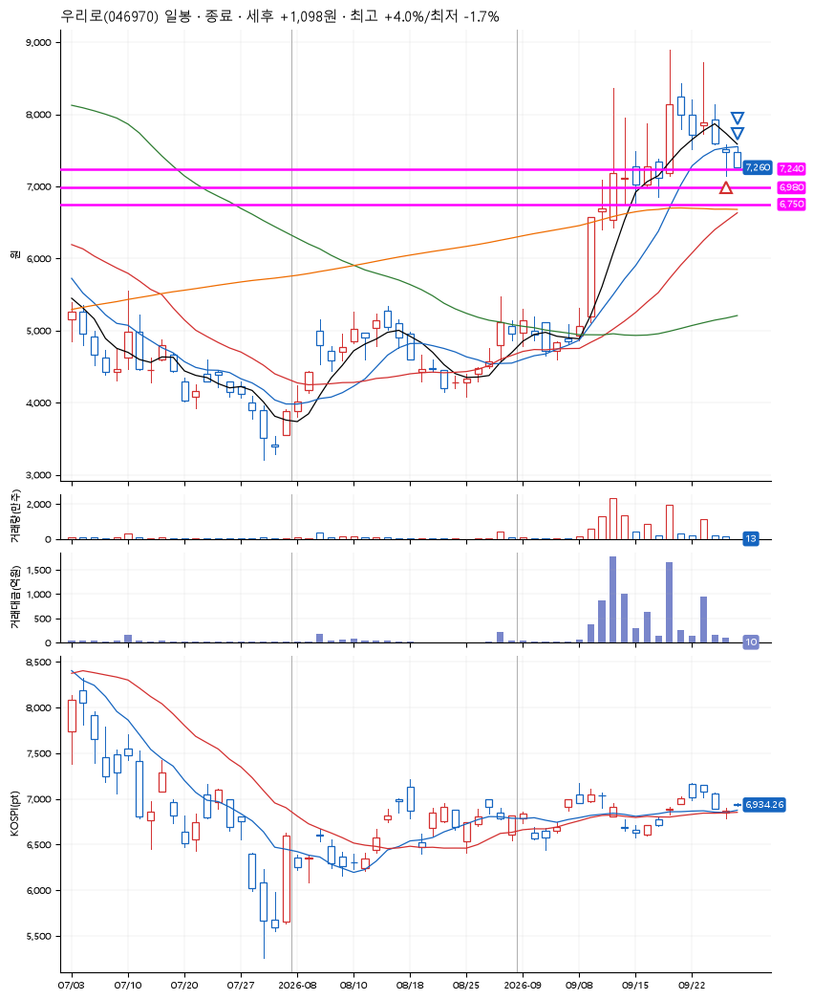
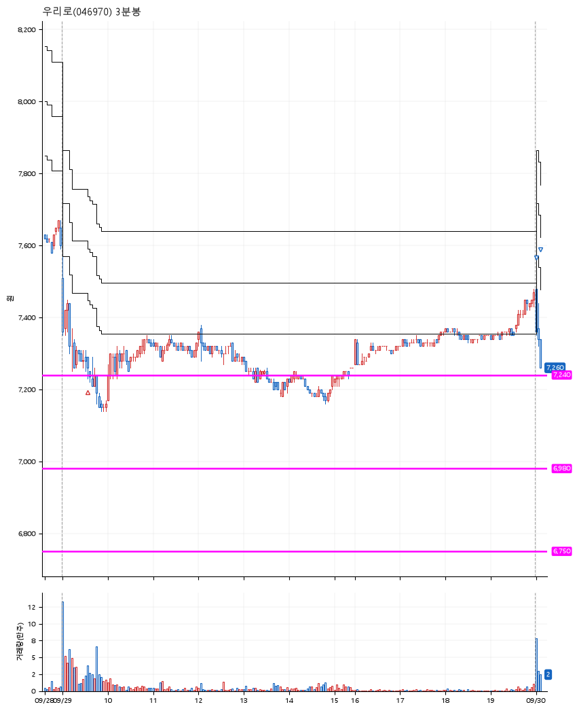

# 우리로(046970) · 2026-09-30

**1차 매수 → 3% 익절 → 본절 이탈**

진입 2026-09-29 09:35 (D+5) · 청산 2026-09-30 09:07 (D+6) · 보유 2일차

| | |
|---|---|
| 결과 | 익절 |
| 평단 / 수량 | 7,260원 · 18주 |
| 투입 | 130,680원 |
| 세후 손익 | +1,098원 (+0.84%) |
| 최고 / 최저 | +4.0% / -1.7% |
| 당일 등락 | -0.80% |
| 보유기간 | 2일차 |

## 3선

| | |
|---|---|
| 1선 | 7,240원 |
| 2선 | 6,980원 |
| 3선 | 6,750원 |

기준봉 2026-09-18 (D+6)

`#KOSPI하락횡보장` `#시장을이기는종목` `#테마주` `#섹터주`

> 5G 통신장비

## 차트

**일봉**

**3분봉**

## 체결

| 시각 | 구분 | 수량 | 판정가 | 체결가 | 오차 |
|---|---|---|---|---|---|
| 09:35 | 매수 | 18주 | 7,240 | 7,260 | +0.28% |
| 09:00 | 매도 | 7주 | 7,480 | 7,460 | -0.27% |
| 09:07 | 매도 | 11주 | 7,260 | 7,260 | +0.00% |

## 잘한 점

기준봉 이후 처음으로 깊게 눌린 자리.

## 아쉬운 점

조금은 공격적으로 진입한 자리라 3% 익절한 것이 다행.
