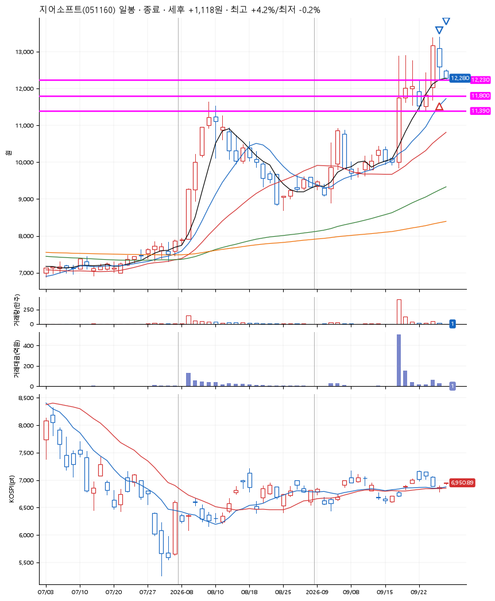
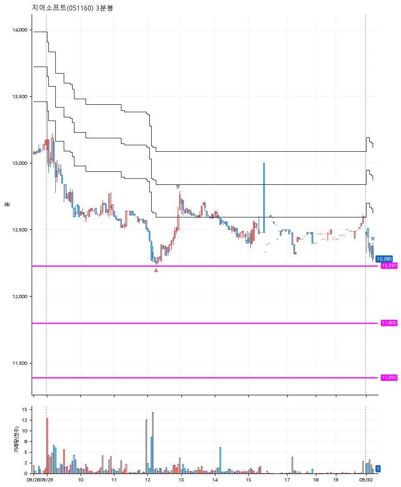

# 지어소프트(051160) · 2026-09-30

**1차 매수 → 3% 익절 → 본절 이탈**

진입 2026-09-29 12:15 (D+1) · 청산 2026-09-30 09:14 (D+2) · 보유 2일차

| | |
|---|---|
| 결과 | 익절 |
| 평단 / 수량 | 12,270원 · 11주 |
| 투입 | 134,970원 |
| 세후 손익 | +1,118원 (+0.83%) |
| 최고 / 최저 | +4.2% / -0.2% |
| 당일 등락 | -4.97% |
| 보유기간 | 2일차 |

## 3선

| | |
|---|---|
| 1선 | 12,230원 |
| 2선 | 11,800원 |
| 3선 | 11,390원 |

기준봉 2026-09-28 (D+2)

`#KOSPI하락횡보장` `#시장을이기는종목`

> 유상증자

## 차트

**일봉**

**3분봉**

## 체결

| 시각 | 구분 | 수량 | 판정가 | 체결가 | 오차 |
|---|---|---|---|---|---|
| 12:15 | 매수 | 11주 | 12,230 | 12,270 | +0.33% |
| 12:56 | 매도 | 4주 | 12,640 | 12,610 | -0.24% |
| 09:14 | 매도 | 7주 | 12,270 | 12,280 | +0.08% |

## 잘한 점

_(미작성)_

## 아쉬운 점

_(미작성)_
