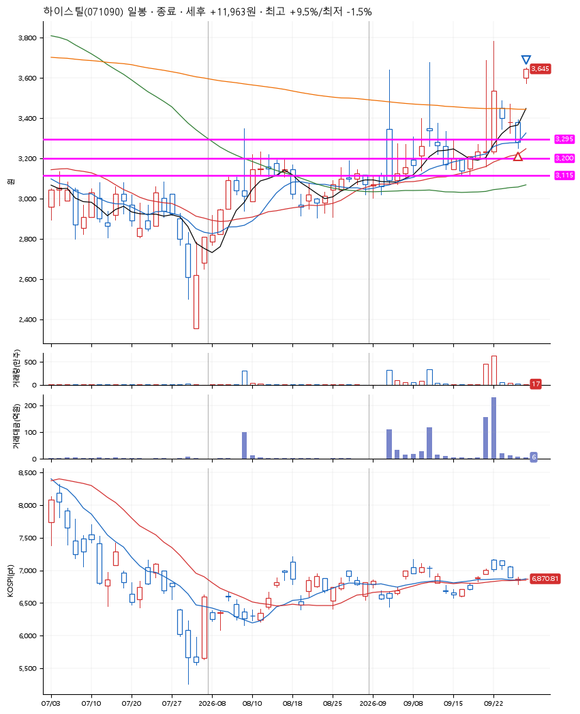
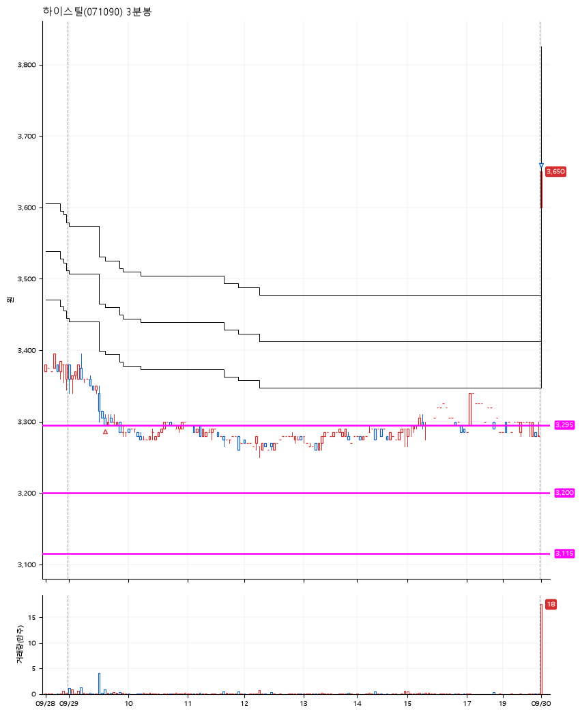

# 하이스틸(071090) · 2026-09-30

**1차 매수 → 7% 익절**

진입 2026-09-29 09:38 (D+3) · 청산 2026-09-30 09:00 (D+4) · 보유 2일차

| | |
|---|---|
| 결과 | 익절 |
| 평단 / 수량 | 3,300원 · 41주 |
| 투입 | 135,300원 |
| 세후 손익 | +11,963원 (+8.84%) |
| 최고 / 최저 | +9.5% / -1.5% |
| 당일 등락 | +8.89% |
| 보유기간 | 2일차 |

## 3선

| | |
|---|---|
| 1선 | 3,295원 |
| 2선 | 3,200원 |
| 3선 | 3,115원 |

기준봉 2026-09-22 (D+4)

`#KOSPI하락횡보장` `#시장을이기는종목`

## 차트

**일봉**

**3분봉**

## 체결

| 시각 | 구분 | 수량 | 판정가 | 체결가 | 오차 |
|---|---|---|---|---|---|
| 09:38 | 매수 | 41주 | 3,295 | 3,300 | +0.15% |
| 09:00 | 매도 | 41주 | 3,600 | 3,600 | +0.00% |

## 잘한 점

_(미작성)_

## 아쉬운 점

_(미작성)_
