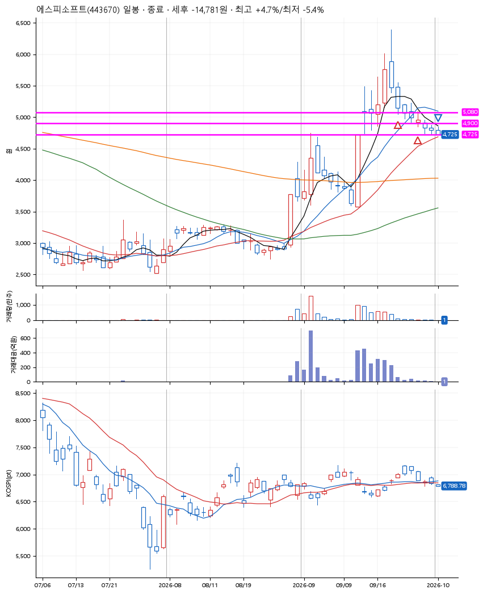
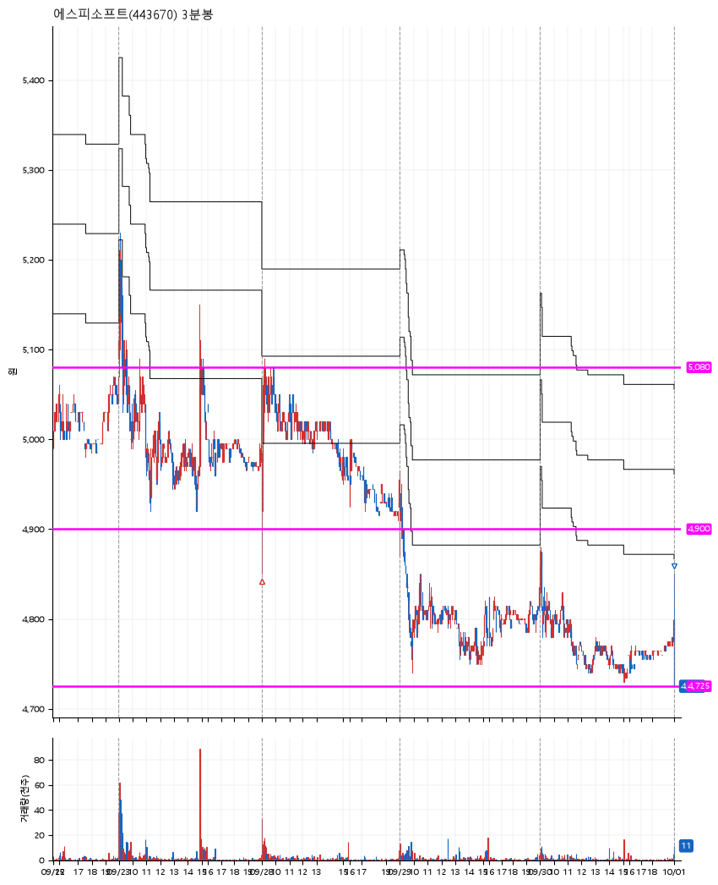

# 에스피소프트(443670) · 2026-10-01

**2차 매수 → 손절**

진입 2026-09-21 10:50 (D+2) · 청산 2026-10-01 09:02 (D+8) · 보유 7일차

| | |
|---|---|
| 결과 | 손절 |
| 평단 / 수량 | 4,993원 · 53주 |
| 투입 | 264,630원 |
| 세후 손익 | -14,781원 (-5.59%) |
| 최고 / 최저 | +4.7% / -5.4% |
| 당일 등락 | -0.62% |
| 보유기간 | 11일차 |

## 3선

| | |
|---|---|
| 1선 | 5,080원 |
| 2선 | 4,900원 |
| 3선 | 4,725원 |

기준봉 2026-09-17 (D+8)

`#KOSPI하락횡보장` `#시장을이기는종목` `#테마주`

> AI 보안주

## 차트

**일봉**

**3분봉**

## 체결

| 시각 | 구분 | 수량 | 판정가 | 체결가 | 오차 |
|---|---|---|---|---|---|
| 10:50 | 매수 | 26주 | 5,080 | 5,100 | +0.39% |
| 09:01 | 매수 | 27주 | 4,900 | 4,890 | -0.20% |
| 09:02 | 매도 | 53주 | 4,725 | 4,725 | +0.00% |

## 잘한 점

.

## 아쉬운 점

3선을 설정할 때부터 애매. 직전 전고점을 지지받을거라 기대했지만, 그러지 못하고 3선 이탈 발생. 더군다나 매수 후 3일이상 안가면 팔아야 하는데 그러지 못하는 대응이 손실을 더 크게 만들었다.
