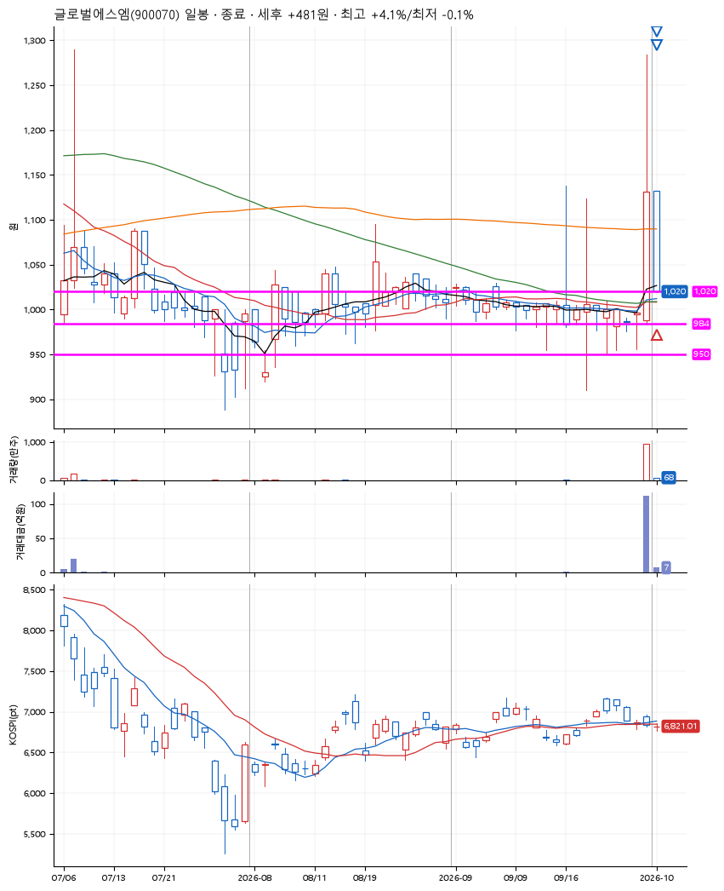
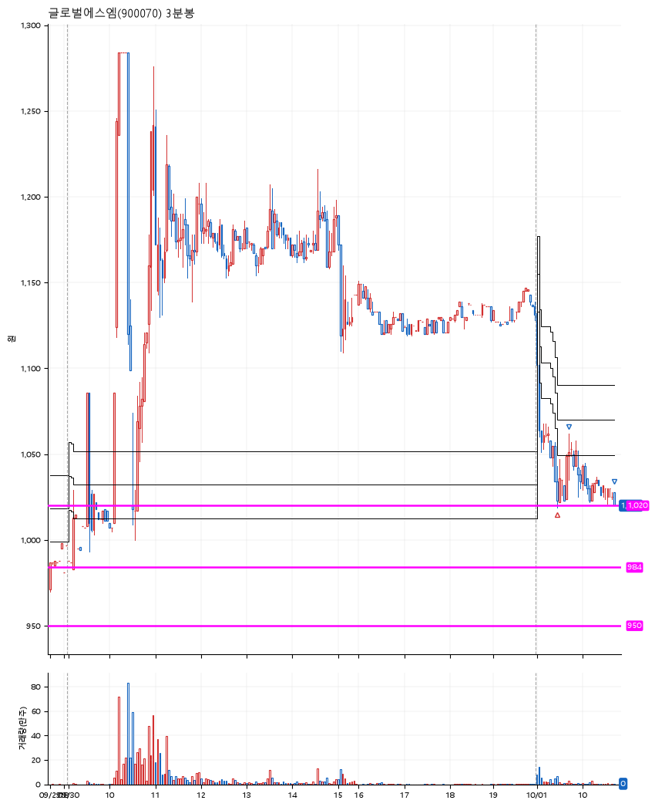

# 글로벌에스엠(900070) · 2026-10-01

**1차 매수 → 3% 익절 → 본절 이탈**

진입 2026-10-01 09:28 (D+1) · 청산 2026-10-01 10:43 (D+1) · 보유 1시간 14분

| | |
|---|---|
| 결과 | 익절 |
| 평단 / 수량 | 1,020원 · 134주 |
| 투입 | 136,680원 |
| 세후 손익 | +481원 (+0.35%) |
| 최고 / 최저 | +4.1% / -0.1% |
| 당일 등락 | -2.56% |
| 보유기간 | 1시간 14분 |

## 3선

| | |
|---|---|
| 1선 | 1,020원 |
| 2선 | 984원 |
| 3선 | 950원 |

기준봉 2026-09-30 (D+1)

`#KOSPI하락횡보장` `#시장을이기는종목` `#테마주` `#섹터주`

> 2차전지 전기차

## 차트

**일봉**

**3분봉**

## 체결

| 시각 | 구분 | 수량 | 판정가 | 체결가 | 오차 |
|---|---|---|---|---|---|
| 09:28 | 매수 | 134주 | 1,020 | 1,020 | +0.00% |
| 09:42 | 매도 | 53주 | 1,053 | 1,035 | -1.71% |
| 10:43 | 매도 | 81주 | 1,020 | 1,020 | +0.00% |

## 잘한 점

굉장히 길게 박스권을 그려서 이 기준봉 이후는 무조건이다 라고 생각함.

## 아쉬운 점

3% 익절 이후 본절에서 청산했지만, 이 청산가가 정확한 저점. 실제로 들고있었으면 이후 7% 익절까지 봤겠지만, 이것은 나의 시나리오 밖의 얘기.
