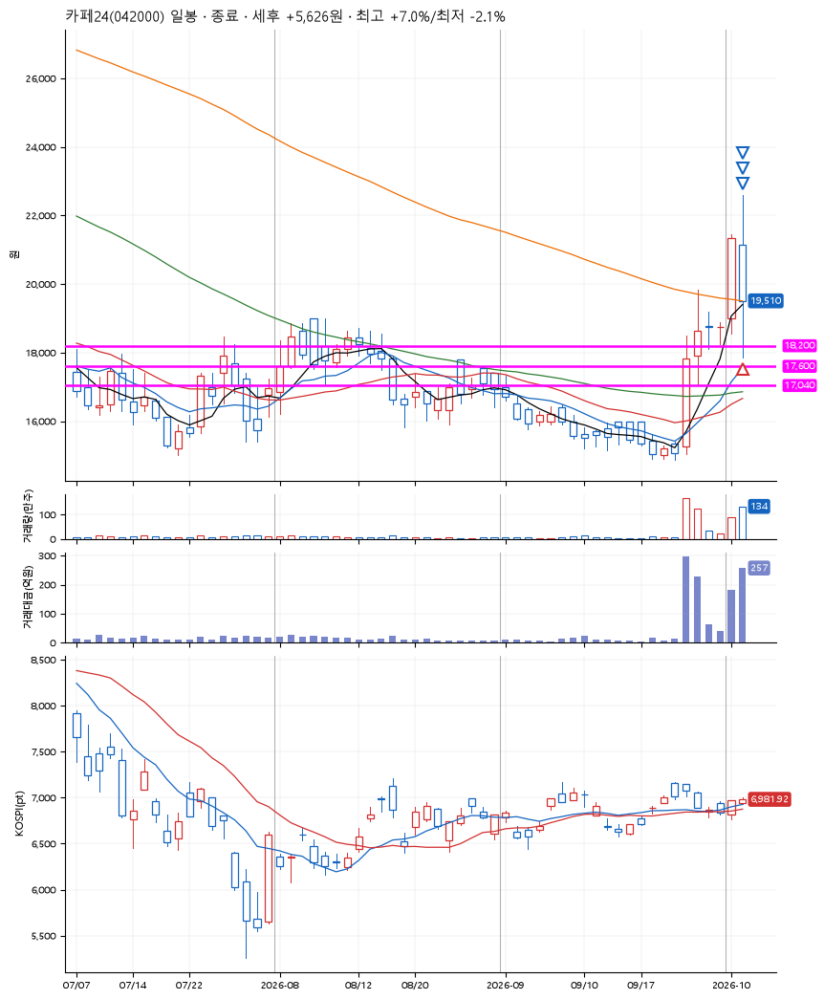
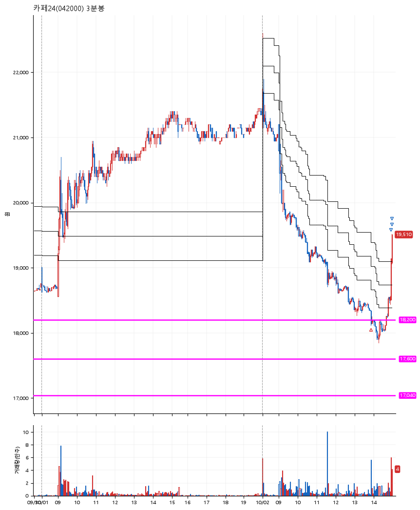

# 카페24(042000) · 2026-10-02

**1차 매수 → 3% 익절 → 5% 익절 → 7% 익절**

진입 2026-10-02 13:53 (D+1) · 청산 2026-10-02 14:57 (D+1) · 보유 1시간 4분

| | |
|---|---|
| 결과 | 익절 |
| 평단 / 수량 | 18,240원 · 7주 |
| 투입 | 127,680원 |
| 세후 손익 | +5,626원 (+4.41%) |
| 최고 / 최저 | +7.0% / -2.1% |
| 당일 등락 | -2.36% |
| 보유기간 | 1시간 4분 |

## 3선

| | |
|---|---|
| 1선 | 18,200원 |
| 2선 | 17,600원 |
| 3선 | 17,040원 |

기준봉 2026-10-01 (D+1)

`#KOSPI하락횡보장` `#시장을이기는종목`

## 차트

**일봉**

**3분봉**

## 체결

| 시각 | 구분 | 수량 | 판정가 | 체결가 | 오차 |
|---|---|---|---|---|---|
| 13:53 | 매수 | 7주 | 18,200 | 18,240 | +0.22% |
| 14:55 | 매도 | 2주 | 18,790 | 18,800 | +0.05% |
| 14:57 | 매도 | 4주 | 19,160 | 19,140 | -0.10% |
| 14:57 | 매도 | 1주 | 19,520 | 19,450 | -0.36% |

## 잘한 점

사실 상당히 공격적이었던 3선 설정. 급등하여 운이 좋게 익절 성공.

## 아쉬운 점

다시 기준봉 시점으로 돌아갔을 때, 똑같은 3선을 설정할 수 있을 지가 의문.
