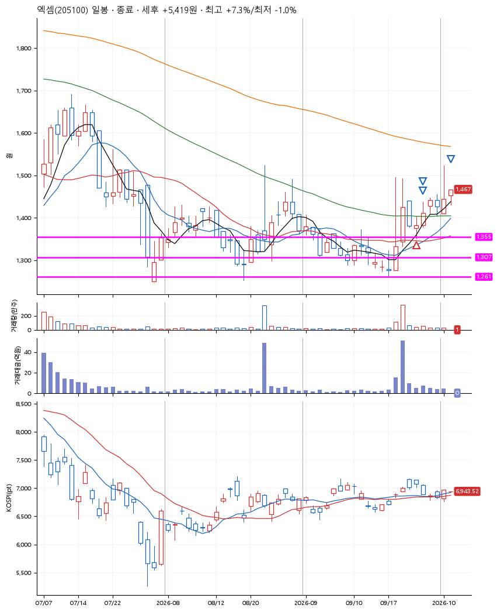
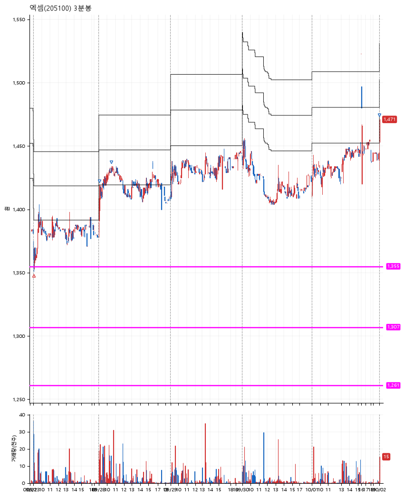

# 엑셈(205100) · 2026-10-02

**1차 매수 → 3% 익절 → 5% 익절 → 7% 익절**

진입 2026-09-23 09:03 (D+2) · 청산 2026-10-02 09:01 (D+7) · 보유 6일차

| | |
|---|---|
| 결과 | 익절 |
| 평단 / 수량 | 1,365원 · 101주 |
| 투입 | 137,865원 |
| 세후 손익 | +5,419원 (+3.93%) |
| 최고 / 최저 | +7.3% / -1.0% |
| 당일 등락 | -0.34% |
| 보유기간 | 10일차 |

## 3선

| | |
|---|---|
| 1선 | 1,355원 |
| 2선 | 1,307원 |
| 3선 | 1,261원 |

기준봉 2026-09-21 (D+7)

`#KOSPI하락횡보장` `#시장을이기는종목`

> 자사주 취득

## 차트

**일봉**

**3분봉**

## 체결

| 시각 | 구분 | 수량 | 판정가 | 체결가 | 오차 |
|---|---|---|---|---|---|
| 09:03 | 매수 | 101주 | 1,355 | 1,365 | +0.74% |
| 09:05 | 매도 | 40주 | 1,406 | 1,401 | -0.36% |
| 10:30 | 매도 | 50주 | 1,434 | 1,430 | -0.28% |
| 09:01 | 매도 | 11주 | 1,461 | 1,461 | +0.00% |

## 잘한 점

_(미작성)_

## 아쉬운 점

잘한 점 : 박스가 명확하게 보이진 않았지만, 3바닥을 찍고 약 9월부터 박스권을 그리는 듯한 움직임. 이런 박스를 보는 눈을 키워야 할 듯.
.
