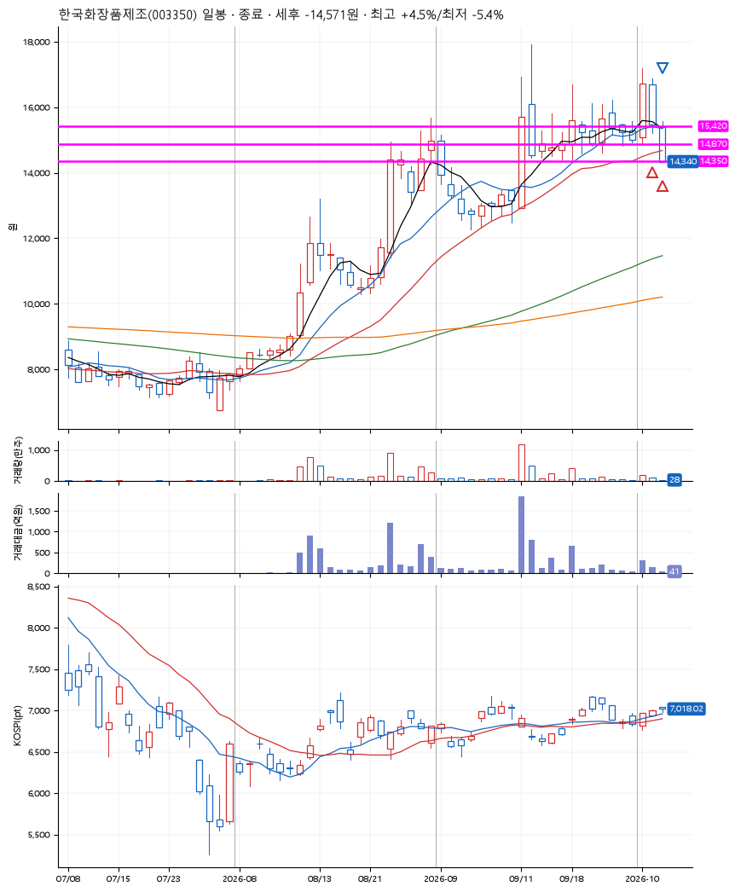
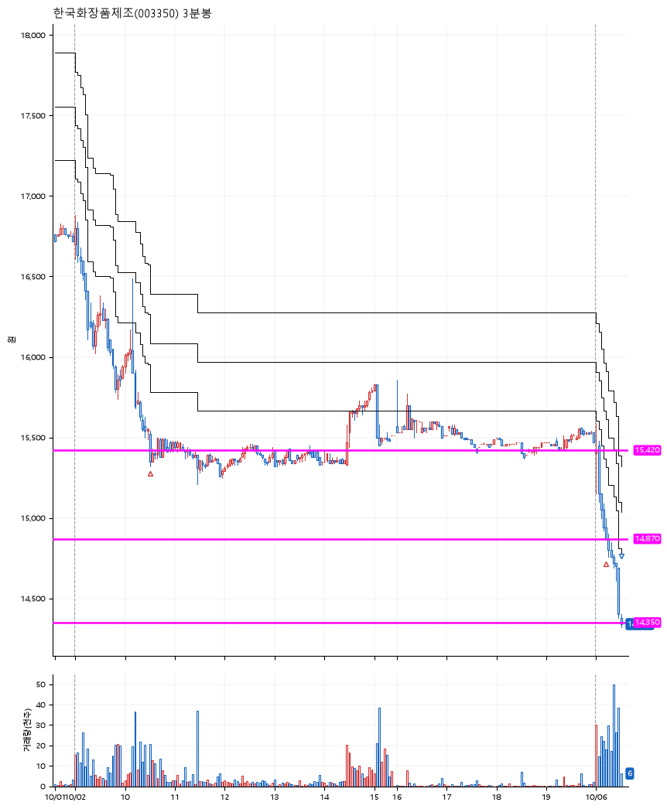

# 한국화장품제조(003350) · 2026-10-06

**2차 매수 → 손절**

진입 2026-10-02 10:31 (D+1) · 청산 2026-10-06 09:30 (D+2) · 보유 2일차

| | |
|---|---|
| 결과 | 손절 |
| 평단 / 수량 | 15,144원 · 17주 |
| 투입 | 257,450원 |
| 세후 손익 | -14,571원 (-5.66%) |
| 최고 / 최저 | +4.5% / -5.4% |
| 당일 등락 | -2.34% |
| 보유기간 | 5일차 |

## 3선

| | |
|---|---|
| 1선 | 15,420원 |
| 2선 | 14,870원 |
| 3선 | 14,350원 |

기준봉 2026-10-01 (D+2)

`#KOSPI하락횡보장` `#시장을이기는종목` `#테마주`

> 화장품

## 차트

**일봉**

**3분봉**

## 체결

| 시각 | 구분 | 수량 | 판정가 | 체결가 | 오차 |
|---|---|---|---|---|---|
| 10:31 | 매수 | 8주 | 15,420 | 15,430 | +0.06% |
| 09:14 | 매수 | 9주 | 14,870 | 14,890 | +0.13% |
| 09:30 | 매도 | 17주 | 14,350 | 14,320 | -0.21% |

## 잘한 점

.

## 아쉬운 점

기준봉 이전에 꽤 안정적인 박스를 그렸고 이전 기준봉 전의 전고점에서 지지받늘거라 시나리오를 세웠지만 결과는 아쉬움. 3선을 딱 하락하여 다시 상승하는 움직임.
