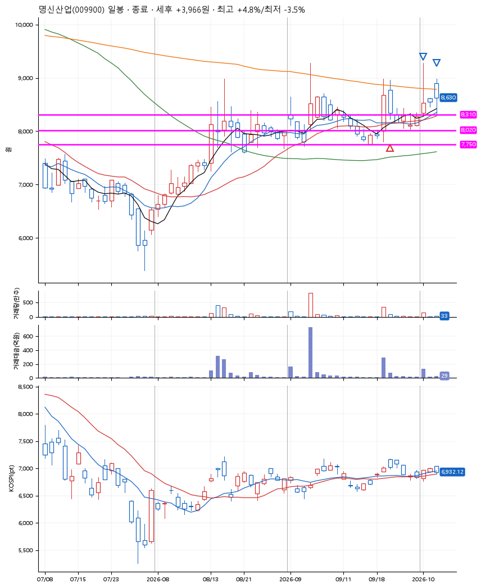
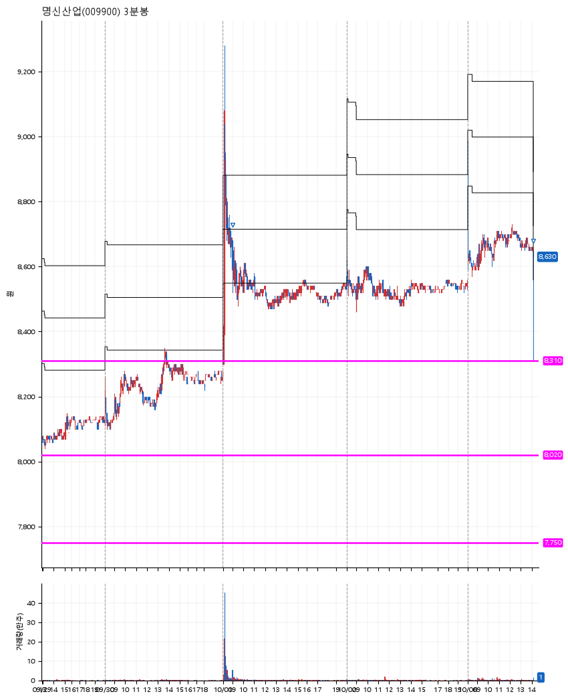

# 명신산업(009900) · 2026-10-06

**1차 매수 → 3% 익절 → 본절 이탈**

진입 2026-09-22 13:22 (D+1) · 청산 2026-10-06 14:09 (D+8) · 보유 8일차

| | |
|---|---|
| 결과 | 익절 |
| 평단 / 수량 | 8,330원 · 16주 |
| 투입 | 133,280원 |
| 세후 손익 | +3,966원 (+2.98%) |
| 최고 / 최저 | +4.8% / -3.5% |
| 당일 등락 | +0.69% |
| 보유기간 | 15일차 |

## 3선

| | |
|---|---|
| 1선 | 8,310원 |
| 2선 | 8,020원 |
| 3선 | 7,750원 |

기준봉 2026-09-21 (D+8)

`#KOSPI하락횡보장` `#시장을이기는종목`

> 테슬라 부품공급

## 차트

**일봉**

**3분봉**

## 체결

| 시각 | 구분 | 수량 | 판정가 | 체결가 | 오차 |
|---|---|---|---|---|---|
| 13:22 | 매수 | 16주 | 8,310 | 8,330 | +0.24% |
| 09:00 | 매도 | 6주 | 8,680 | 8,660 | -0.23% |
| 14:09 | 매도 | 10주 | 8,330 | 8,560 | +2.76% |

## 잘한 점

_(미작성)_

## 아쉬운 점

_(미작성)_
