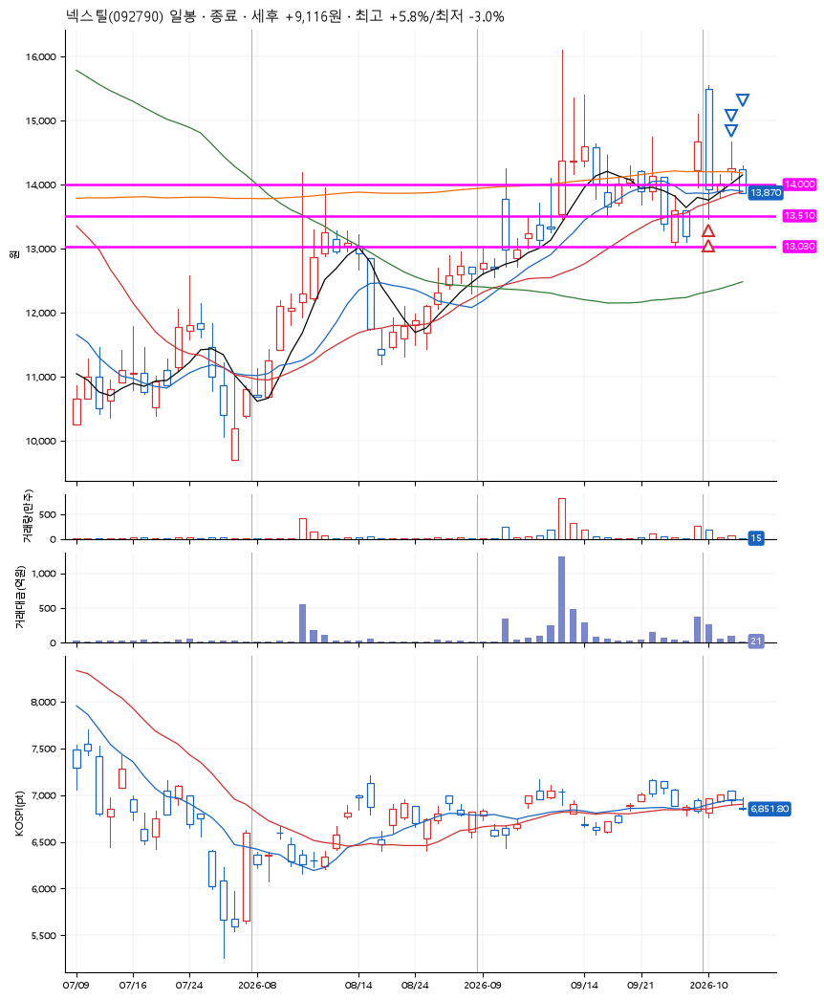
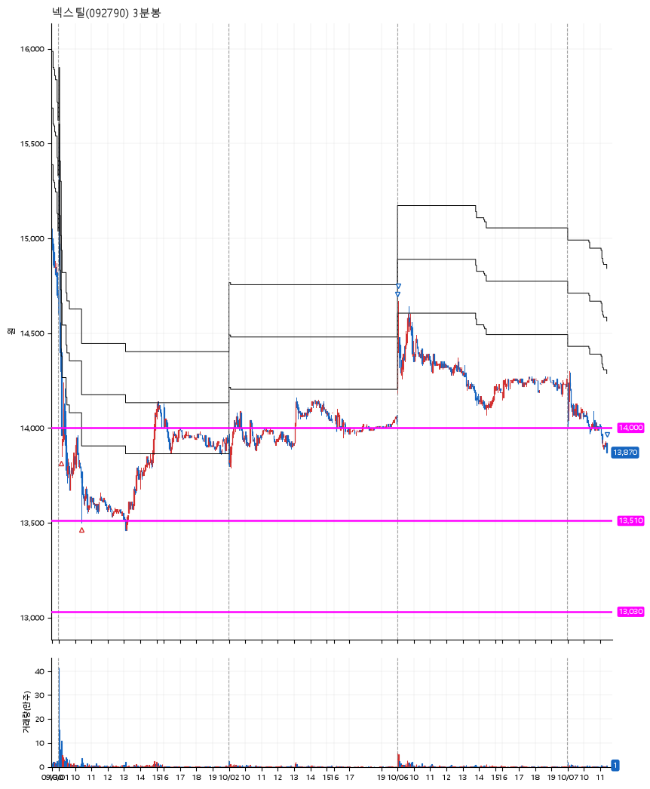

# 넥스틸(092790) · 2026-10-07

**2차 매수 → 3% 익절 → 5% 익절 → 본절 이탈**

진입 2026-10-01 09:10 (D+1) · 청산 2026-10-07 11:25 (D+4) · 보유 4일차

| | |
|---|---|
| 결과 | 익절 |
| 평단 / 수량 | 13,870원 · 19주 |
| 투입 | 263,530원 |
| 세후 손익 | +9,116원 (+3.46%) |
| 최고 / 최저 | +5.8% / -3.0% |
| 당일 등락 | -3.58% |
| 보유기간 | 7일차 |

## 3선

| | |
|---|---|
| 1선 | 14,000원 |
| 2선 | 13,510원 |
| 3선 | 13,030원 |

기준봉 2026-09-30 (D+4)

`#KOSPI하락횡보장` `#시장을이기는종목` `#테마주`

> 알래스카 LNG

## 차트

**일봉**

**3분봉**

## 체결

| 시각 | 구분 | 수량 | 판정가 | 체결가 | 오차 |
|---|---|---|---|---|---|
| 09:10 | 매수 | 9주 | 14,000 | 14,070 | +0.50% |
| 10:25 | 매수 | 10주 | 13,510 | 13,690 | +1.33% |
| 09:00 | 매도 | 7주 | 14,290 | 14,290 | +0.00% |
| 09:03 | 매도 | 10주 | 14,570 | 14,550 | -0.14% |
| 11:25 | 매도 | 2주 | 13,870 | 13,870 | +0.00% |

## 잘한 점

_(미작성)_

## 아쉬운 점

_(미작성)_
