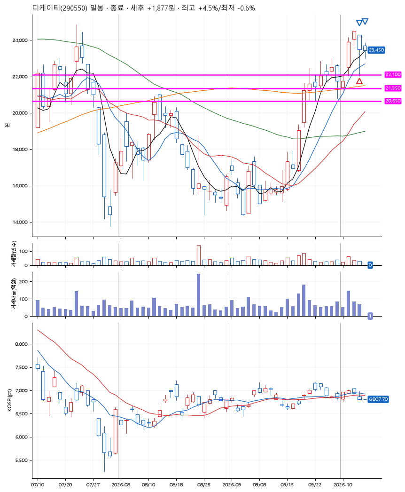
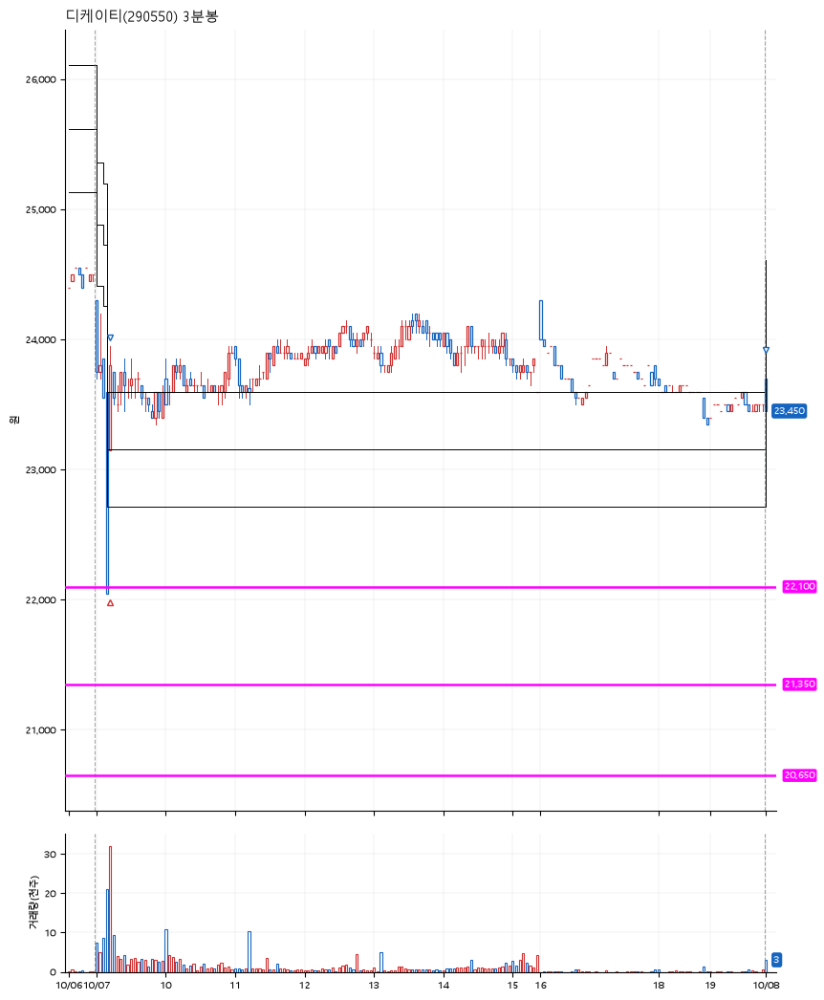

# 디케이티(290550) · 2026-10-08

**1차 매수 → 3% 익절 → 본절 이탈**

진입 2026-10-07 09:13 (D+2) · 청산 2026-10-08 09:01 (D+3) · 보유 2일차

| | |
|---|---|
| 결과 | 익절 |
| 평단 / 수량 | 23,150원 · 6주 |
| 투입 | 138,900원 |
| 세후 손익 | +1,877원 (+1.35%) |
| 최고 / 최저 | +4.5% / -0.6% |
| 당일 등락 | +7.81% |
| 보유기간 | 2일차 |

## 3선

| | |
|---|---|
| 1선 | 22,100원 |
| 2선 | 21,350원 |
| 3선 | 20,650원 |

기준봉 2026-10-02 (D+3)

`#KOSPI하락횡보장` `#시장을이기는종목` `#테마주`

> 폴더블폰 스마트폰

## 차트

**일봉**

**3분봉**

## 체결

| 시각 | 구분 | 수량 | 판정가 | 체결가 | 오차 |
|---|---|---|---|---|---|
| 09:13 | 매수 | 6주 | 22,050 | 23,150 | +4.99% |
| 09:14 | 매도 | 2주 | 23,900 | 23,750 | -0.63% |
| 09:01 | 매도 | 4주 | 23,150 | 23,400 | +1.08% |

## 잘한 점

_(미작성)_

## 아쉬운 점

_(미작성)_
