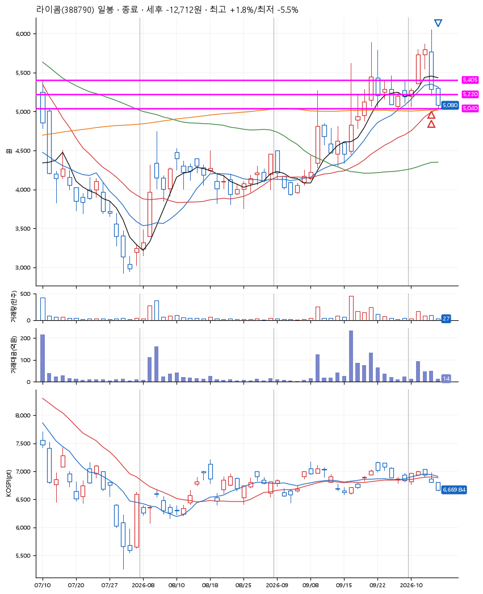
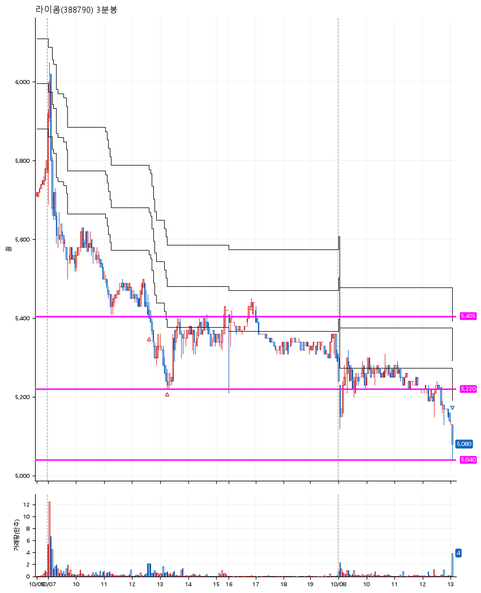

# 라이콤(388790) · 2026-10-08

**2차 매수 → 손절**

진입 2026-10-07 12:38 (D+2) · 청산 2026-10-08 13:03 (D+3) · 보유 2일차

| | |
|---|---|
| 결과 | 손절 |
| 평단 / 수량 | 5,334원 · 51주 |
| 투입 | 272,010원 |
| 세후 손익 | -12,712원 (-4.67%) |
| 최고 / 최저 | +1.8% / -5.5% |
| 당일 등락 | -2.45% |
| 보유기간 | 2일차 |

## 3선

| | |
|---|---|
| 1선 | 5,405원 |
| 2선 | 5,220원 |
| 3선 | 5,040원 |

기준봉 2026-10-02 (D+3)

`#KOSPI하락횡보장` `#시장을이기는종목` `#테마주`

> 5G 광통신 통신장비

## 차트

**일봉**

**3분봉**

## 체결

| 시각 | 구분 | 수량 | 판정가 | 체결가 | 오차 |
|---|---|---|---|---|---|
| 12:38 | 매수 | 25주 | 5,400 | 5,410 | +0.19% |
| 13:17 | 매수 | 26주 | 5,220 | 5,260 | +0.77% |
| 13:03 | 매도 | 51주 | 5,040 | 5,096 | +1.11% |

## 잘한 점

_(미작성)_

## 아쉬운 점

_(미작성)_
